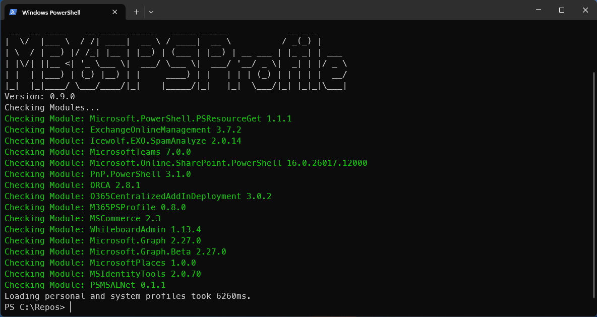
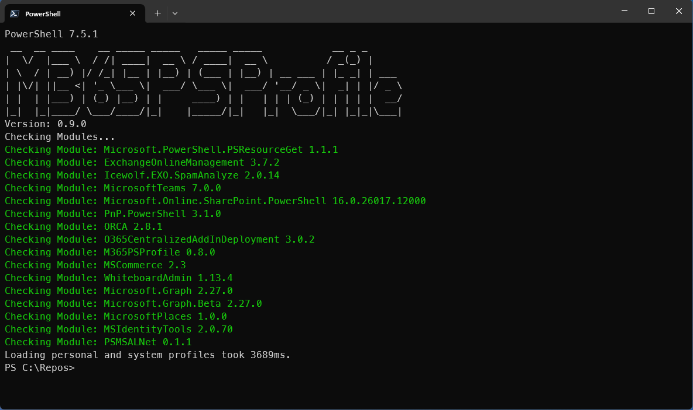

# M365PSProfile

If you're an Microsoft 365 Administrator, you need to have several PowerShell Modules for Managing an M365 Environement.

We've created a flexible Module, that simplifies the Installation and Update of these Modules.

## Our Journey

A few Years ago Andres had created a PowerShell Profile Script that installed all the M365 Modules.
The Modules where only installed when running as Administrator in the "AllUsers" Scope.

That approach had some downsites:

- Updating the Code required the User download the Script and Update the Profile for every Update
- Required "Run as Admin" for installation of Modules
- Updating Modules took a long Time ☕
- The Modules where defined static in the Script

Over time - that approach became unmanageable.

## Goals

So we decided to write a Module that handles the Logic and can be updated from the PowerShell Gallery.

Our Goals are:

- Simple One-Liner in the [PowerShell Profile](https://learn.microsoft.com/en-us/powershell/module/microsoft.powershell.core/about/about_profiles?view=powershell-7.3)
- No Admin Rights required -> Installation in the "CurrentUser" Scope
- Fast and configurable -> Predefined Modules or can be defined by yourself
- Support for PowerShell 5 and 7 (Install in CurrentUser Scope)
- Parameter for Modules that should be installed and updated
- Use the [Microsoft.PowerShell.PSResourceGet](https://learn.microsoft.com/en-us/powershell/module/microsoft.powershell.psresourceget/?view=powershellget-3.x) (included in PowerShell 7.4)

## Installation

You need to install the Module

```pwsh
#PowerShellGet
Install-Module -Name M365PSProfile -Scope CurrentUser

#Microsoft.PowerShell.PSResourceGet
Install-PSResource -Name M365PSProfile
```


### Available Commands

You can view the available Commands of the Module with the command below

```pwsh
Get-Command -Module M365PSProfile
```


### What you have to put into your Profile

If you don't have an existing PowerShell Profile you can simply use the command below.

You have to do that for PowerShell 5 and PowerShell 7

```pwsh
Add-M365PSProfile
```


If you have already a PowerShell Profile you need to add at least one line to your PowerShell Profile


```pwsh
Import-Module -Name M365PSProfile
#Install or updates the default Modules (what we think every M365 Admin needs) in the CurrentUser Scope
Install-M365Module
```

If you have specific Modules that you want to keep up to date, use the -Modules Parameter with an Array of ModuleNames

```pwsh
#Install or Updates the Modules in the Array
Install-M365Module -Modules @("ExchangeOnlineManagement", "Icewolf.EXO.SpamAnalyze", "MicrosoftTeams", "Microsoft.Online.SharePoint.PowerShell", "PnP.PowerShell", "ORCA", "M365PSProfile", "O365CentralizedAddInDeployment", "MSCommerce", "WhiteboardAdmin", "Microsoft.Graph", "Microsoft.Graph.Beta", "MSIdentityTools", "PSMSALNet")
```

With these commands in the Profile it looks like this

PowerShell 5



PowerShell 7



### Script Parameters

```pwsh
-Modules @(ArrayOfModulenames)
-Scope [Default:CurrentUser/AllUsers]
-AsciiArt [Default:true/false]
-RunInVSCode [Default:false/true]
```

### PowerShell Profiles

How do PowerShell Profiles work?
- MS Learn [PowerShell Profiles](https://learn.microsoft.com/en-us/powershell/module/microsoft.powershell.core/about/about_profiles?view=powershell-7.4)

Basically there exist four Types

- All Users, All Hosts
- All Users, Current Host
- Current User, All Hosts
- Current user, Current Host

Be aware that there are diffrent Profile Files for PowerShell 5 and 7.
For Example "Current user, Current Host" on Windows

```pwsh
#PowerShell 5.1
#$HOME\Documents\WindowsPowerShell\Microsoft.PowerShell_profile.ps1
$Profile
#View or Edit Profile
notepad $Profile

#PowerShell 7
#$HOME\Documents\PowerShell\Microsoft.PowerShell_profile.ps1
$Profile
#View or Edit Profile
notepad $Profile
```

### Standard Modules that are installed with this Module

These are the Modules that are installed if you don't use an Array with the -Modules Parameter.

| Module | Description |
| --- | --- |
| ExchangeOnlineManagement | Exchange Online |
| Icewolf.EXO.SpamAnalyze | Exchange Online Message Tracking / [SpamAnalyze](https://github.com/BohrenAn/GitHub_PowerShellScripts/tree/main/Icewolf.EXO.SpamAnalyze) |
| MicrosoftTeams | Microsoft Teams |
| Microsoft.Online.SharePoint.PowerShell | Microsoft Sharepoint |
| PnP.PowerShell | SharePoint / Microsoft Teams |
| ORCA | Defender for Office 365 Recommended Configuration Analyzer |
| O365CentralizedAddInDeployment | Deploy Office Add-Ins |
| M365PSProfile | Keep your M365 Modules up to date |
| MSCommerce | Manage M365 Self Service Purchase |
| WhiteboardAdmin | Manage Whiteboards |
| Microsoft.Graph | Microsoft.Graph Modules https://graph.microsoft.com/v1.0 |
| Microsoft.Graph.Beta | Microsoft.Graph Modules https://graph.microsoft.com/beta |
| PSMSALNet| PowerShell 7.2 MSAL.NET wrapper|
| MSIdentityTools | Additional Functions for Identity |

or you can use this command to list the default Modules

```pwsh
Get-M365StandardModule
```

### Uninstall

For Uninstalling there are three Options

1) Uninstall the Standard Modules

```pwsh
#Uninstalls the Standard M365 Modules
Uninstall-M365Module

#Uninstalls the Standard M365 Modules using the FileMode
Uninstall-M365Module -FileMode

#Uninstall MicrosoftTeams Module using FileMode
Uninstall-M365Module -Module MicrosoftTeams -FileMode

```

2) Uninstall the PSProfile

>Note that PowerShell 5 and 7 have separate PowerShell Profiles

You need to edit the PowerShell Profile and remove these two Lines

```pwsh
Import-Module -Name M365PSProfile
Install-M365Module
```

To view or delete the PowerShell Profile you can use these Commands

```pwsh
#View the Content of your PowerShell Profile
Get-Content $Profile

#Delete the PowerShell Profile
Remove-Item $Profile
```

3) Uninstall the Module
You can uninstall the M365PSProfile Module. Make sure you have removed the Lines in Option 2

```pwsh
#PowerShellGet
Uninstall-Module -Name M365PSProfile

#Microsoft.PowerShell.PSResourceGet
Uninstall-PSResource -Name M365PSProfile
```

### Modules Path

Show the Path where PowerShell looks for Modules

```pwsh
$env:PSModulePath.Split(";")
```

>Note: The Modules in the Scope "CurrentUser" has precedence over Scope "AllUsers"

## Contribution

How can you contribute?

➡ Check out [CONTRIBUTING.md](./CONTRIBUTING.md)

## Maintainer

- Fabrice Reiser [@fabrisodotps1](https://twitter.com/fabrisodotps1)
- Andres Bohren [@andresbohren](https://twitter.com/andresbohren)
